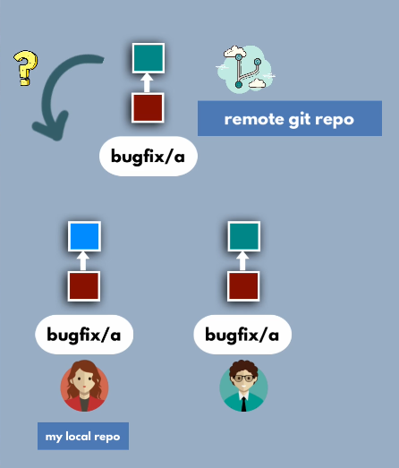
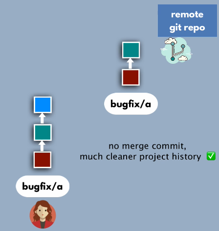

# Rebase concept

> When 2 developers are working in the same branch 

> If the developer B has committed his changes on the remote repo, the developer A doesn't know about those changes... 



> The developer A can't push his changes to the remote repo...


> So developer A must do git pull from remote, but by doing that it will create a new commit 

## Best practice - rebase 

```Git
git pull --r 
```


